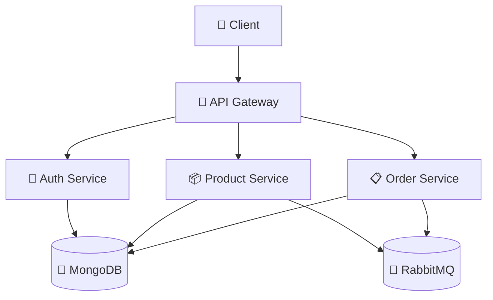

# 🛒 Dự án E-Commerce Microservices

> *Hệ thống backend thương mại điện tử hiện đại với kiến trúc microservices*

## 🏗️ Kiến trúc Hệ thống


  
## 📡 API Endpoints

### 🔐 Auth Service

| Method | Endpoint | Chức năng | Authentication |
|--------|----------|-----------|----------------|
| `POST` | `/register` | 👤 Đăng ký người dùng mới | ❌ |
| `POST` | `/login` | 🔑 Đăng nhập hệ thống | ❌ |
| `GET` | `/dashboard` | 📋 Truy cập vào trang chủ | ✅ |

### 📦 Product Service

| Method | Endpoint | Chức năng | Authentication |
|--------|----------|-----------|----------------|
| `GET` | `/api/products` | 📜 Lấy danh sách sản phẩm | ✅ |
| `POST` | `/api/products` | ➕ Tạo sản phẩm mới | ✅ |
| `POST` | `/api/products/buy` | ✏️ Tạo đơn hàng mới | ✅ |

## ⚙️ Cấu hình Môi trường
### 🔐 Auth Service (.env)
```
# Database
MONGODB_AUTH_URI=mongodb://mongodb:27017/auth-service

# JWT Configuration
JWT_SECRET=your_jwt_secret_key_here

```
### 📦 Product Service (.env)
```
# Database
MONGODB_AUTH_URI=mongodb://mongodb:27017/auth-service
JWT_SECRET=your_jwt_secret_key_here
MONGODB_PRODUCT_URI=mongodb://mongodb:27017/product-service
MONGODB_ORDER_URI=mongodb://mongodb:27017/order-service

```
### 📋 Order Service (.env)
```
MONGODB_AUTH_URI=mongodb://mongodb:27017/auth-service
JWT_SECRET=your_jwt_secret_key_here
MONGODB_PRODUCT_URI=mongodb://mongodb:27017/product-service
MONGODB_ORDER_URI=mongodb://mongodb:27017/order-service

```
## 🗂️ Cấu trúc Dự án
```
EPROJECT-PHASE-1/
├── 🚪 api-gateway/              # API Gateway Service
│   ├── Dockerfile
│   ├── package.json
│   └── index.js
├── 🔐 auth/                     # Authentication Service
│   ├── src/
│   ├── .env
│   ├── Dockerfile
│   ├── package.json
│   └── index.js
├── 📦 product/                  # Product Management Service
│   ├── src/
│   ├── .env
│   ├── Dockerfile
│   ├── package.json
│   └── index.js
├── 📋 order/                    # Order Processing Service
│   ├── src/
│   ├── .env
│   ├── Dockerfile
│   ├── package.json
│   └── index.js
├── 🔧 utils/                    # Shared Utilities
├── 📄 docker-compose.yml        # Docker Orchestration
└── 📝 README.md                 # Project Documentation
```
## 🔄 Giao tiếp giữa các Services
### 🔐 Authentication Flow
- Client → API Gateway → Auth Service → MongoDB
### 📦 Product Management Flow
- Client → API Gateway → Product Service → MongoDB
- Product Service → RabbitMQ → Order Service
### 📋 Order Processing Flow
- Client → API Gateway → Order Service → MongoDB
- Order Service → RabbitMQ → Product Service (Inventory Check)
## 🛠️ Công nghệ Sử dụng
| Category | Technologies |
|----------|--------------|
| 🌐 Backend Framework | Node.js, Express.js |
| 🗄️ Database | MongoDB, Mongoose ODM |
| 📨 Message Broker | RabbitMQ, AMQP Protocol |
| 🔐 Authentication | JWT (JSON Web Tokens) |
| 🐳 Containerization | Docker, Docker Compose |
| 🔄 API Communication | REST API, Message Queues |
| 🔧 Development | Nodemon, Dotenv |
## 🐛 Xử lý Sự cố
# 🔍 Kiểm tra trạng thái hệ thống
```
# Kiểm tra containers đang chạy
docker ps

# Xem logs của service cụ thể
docker logs auth-service
docker logs product-service
docker logs order-service
docker logs api-gateway

# Kiểm tra network
docker network ls
docker network inspect eproject-network
```
## 📈 Monitoring & Logs
### 📊 RabbitMQ Management
Truy cập http://localhost:15672 để theo dõi:
- 📈 Message queues
- 🔄 Connection status
- 📊 System metrics
### 📝 Service Logs
```
# Theo dõi logs real-time
docker-compose logs -f

# Xem logs của specific service
docker-compose logs -f auth
docker-compose logs -f product
docker-compose logs -f order
```
## 🔒 Security Features
✅ JWT-based authentication

✅ Password hashing với bcrypt

✅ CORS configuration

✅ Input validation và sanitization

✅ Environment variables protection

## Ảnh demo
### Đăng ký


### Đăng nhập


### Dashboard no token


### Dashboard with token


### Kiểm tra docker


### Thêm sản phẩm


### Danh sách sản phẩm


### Thêm đơn hàng


## 👥 Đóng góp
Hoan nghênh mọi đóng góp! Để đóng góp vào dự án:

🍴 Fork repository

🌿 Tạo feature branch
```
git checkout -b feature/AmazingFeature
💾 Commit changes

git commit -m 'Add some AmazingFeature'
📤 Push to branch

git push origin feature/AmazingFeature
🔔 Tạo Pull Request
```
## 📋 Quy tắc đóng góp
✅ Tuân thủ code style hiện có

✅ Thêm tests cho tính năng mới

✅ Cập nhật documentation

✅ Đảm bảo tất cả tests pass

## 📄 License
Dự án được phân phối dưới MIT License. Xem file LICENSE để biết thêm chi tiết.

🤝 Liên hệ
- Maintainer: [nctcode]
- Email: [thuan29032004@gmail.com]
- Project Link: https://github.com/nctcode/22685781-NguyenChiThuan-EProject

## 🙏 Acknowledgments
Express.js team

MongoDB community

RabbitMQ documentation

Docker community

<div align="center">
⭐ Hãy star repository nếu bạn thấy dự án hữu ích!
Được xây dựng với ❤️ bằng Node.js và Microservices Architecture

Happy Coding! 🚀

</div> 

